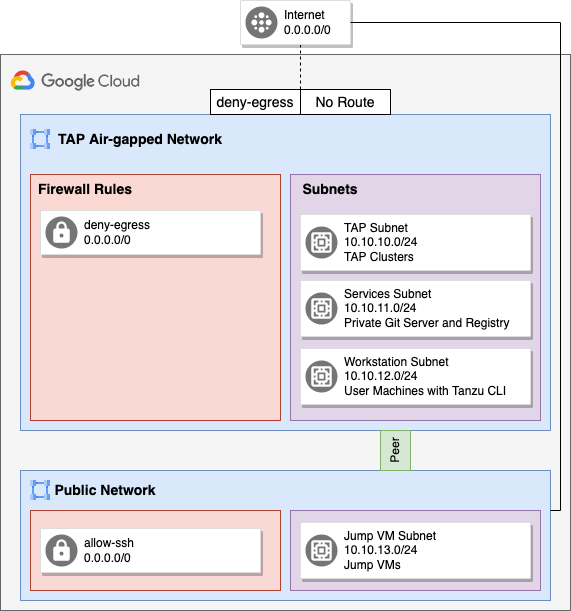

# Air-gapped TAP on Google Cloud



## Setup Environment

```bash
source 00_setup.sh
```

### Step 1: Create Infrastructure (Networks, Subnets, VMs)

```bash
./01_create_network.sh
./02_create_vms.sh
```

### Step 2: Setup Jumpbox

```bash
# gcloud compute ssh --zone "$JP_VM_ZONE" "$JP_VM_NAME" --project "$GCP_PROJECT"

gcloud compute scp scripts/* $JP_VM_NAME:~/ --zone=$JP_VM_ZONE
gcloud compute scp 00_setup.sh  $JP_VM_NAME:~/ --zone=$JP_VM_ZONE
gcloud compute ssh $JP_VM_NAME --zone=$JP_VM_ZONE -- 'sh setup_jumpbox.sh'
gcloud compute ssh $JP_VM_NAME --zone=$JP_VM_ZONE -- 'source 00_setup.sh && sh download.sh'
```

### Step 3: Block access to the internet
```bash

```

## Cleanup Infrastructure
```bash
./98_cleanup_vms.sh
./99_cleanup_network.sh
```

## Useful Links
- [Completely Private GKE Clusters with No Internet Connectivity](https://medium.com/google-cloud/completely-private-gke-clusters-with-no-internet-connectivity-945fffae1ccd)