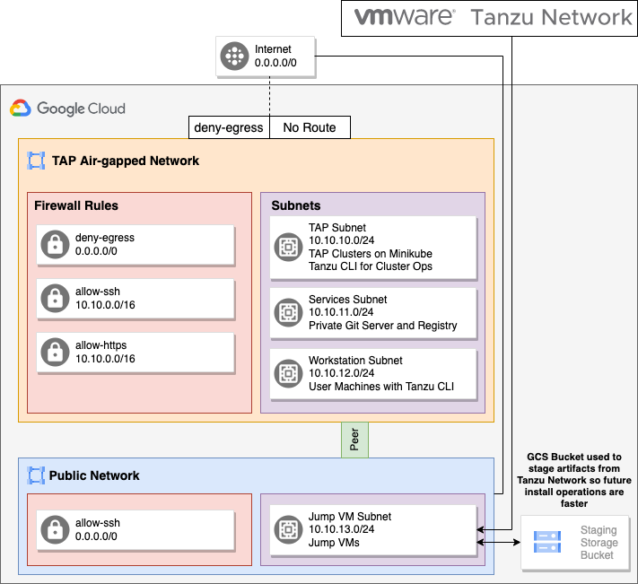

# Air-gapped TAP on Google Cloud



## Setup Environment

```bash
source 00_setup.sh
```

### Step 1: Create Infrastructure (Networks, Subnets, VMs)

```bash
./01_create_network.sh
./02_create_vms.sh
```

### Step 2: Setup Jumpbox

```bash
gcloud compute ssh --zone "$JP_VM_ZONE" "$JP_VM_NAME" --project "$GCP_PROJECT"
```

## Cleanup Infrastructure
```bash
./99_cleanup.sh
```

## Useful Links
- [Completely Private GKE Clusters with No Internet Connectivity](https://medium.com/google-cloud/completely-private-gke-clusters-with-no-internet-connectivity-945fffae1ccd)